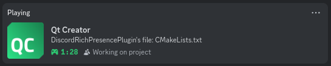

# Discord Rich Presence plugin for Qt Creator

This plugin enables Discord Rich Presence plugin for Qt Creator, utilizing Discord Game SDK.



## 1. Installing

Prebuilt plugin can be downloaded from the release page. On Linux, there are two packages. The portable one includes `discord_game_sdk.so` while the other does not. If your distro does not include Discord Game SDK in its repos, use the portable package. Packages of platforms other than Linux are always portable.

Install the plugin by open Qt Creator's Plugins dialog, `Help > About Plugins > Install Plugin`. Then select the **unextracted** package.

> **Note:** The plugin does not directly link with Discord Game SDK library but dynamically load via QLibrary. The Discord Game SDK library needs to be discoverable by QLibrary at system-specific library locations. Fallback location is right next to plugin library.

## 2. Usage

Discord needs to already be opened before this plugin is loaded. In case of Discord being opened after, reload the plugin via menu `Help > Reload Discord Rich Presence`.

## 3. Building
### 3.1 Requirement

- Build tools:
    - CMake >=3.24
    - KDE Extra CMake Modules >=6.8.0
    
- Build dependencies:
    - Qt >=6.8.0 - Core, Qt 5 compatibility module (build only)
    - Qt Creator development package
    
- Runtime dependencies:
    - This plugin requires [Discord Game SDK](https://dl-game-sdk.discordapp.net/3.2.1/discord_game_sdk.zip). You can download it from Discord, or install it from your distro repos.

### 3.2 Installing dependencies

1. Arch Linux
    
    [Discord Game SDK](https://aur.archlinux.org/packages/discord-game-sdk) is available in the AUR. Qt Creator development package can be install from the `Extra` repo.
    ```
    pacman -S qtcreator-devel extra-cmake-modules
    ```

### 3.3 Configuration

Below are CMake variables that can affect how the plugin is built.

- `DISCORD_CLIENT_ID`: Set this variable to use your own client ID rather using the one provided.
- `DISCORD_GAMESDK_PATH`: Set this variable to use your own Discord Game SDK.
- `BUILD_PORTABLE`: Set this variable to build the plugin as portable with Discord Game SDK also deployed. If `DISCORD_GAMESDK_PATH` is not set, CMake will download a copy from Discord. On Windows and MacOS, this variable is always `ON`. On Linux, if your distro does not ship Discord Game SDK in its repos, it is recommended to turn on this variable.

### 3.3 Build steps
In the project source folder, run the following commands:

- Configure the project.
    ```
    cmake -S . -B build \
        -DCMAKE_BUILD_TYPE=Release \
        -DCMAKE_INSTALL_PREFIX=<install location> \
        <other configuration>
    ```

- Build the program.

    ```
    cmake --build build
    ```
    
    Or with MSVC.
    
    ```
    cmake --build build --target Release
    ```

### 3.4 Install

```
cmake --install build
```

> **A note on installation:** Portable build is meant to be install locally in user's home directory. For portable build, set `CMAKE_INSTAL_PATH` to a temporary folder, and install the plugin via Qt Creator's Plugins dialog by selecting the output files. Take care to ensure that Discord Game SDK library must be place in the same directory as the plugin library.

### 3.5 Uninstall.
```
make uninstall
```
   
## 4. License
The plugin is licensed under [GPL V3](LICENSE).
